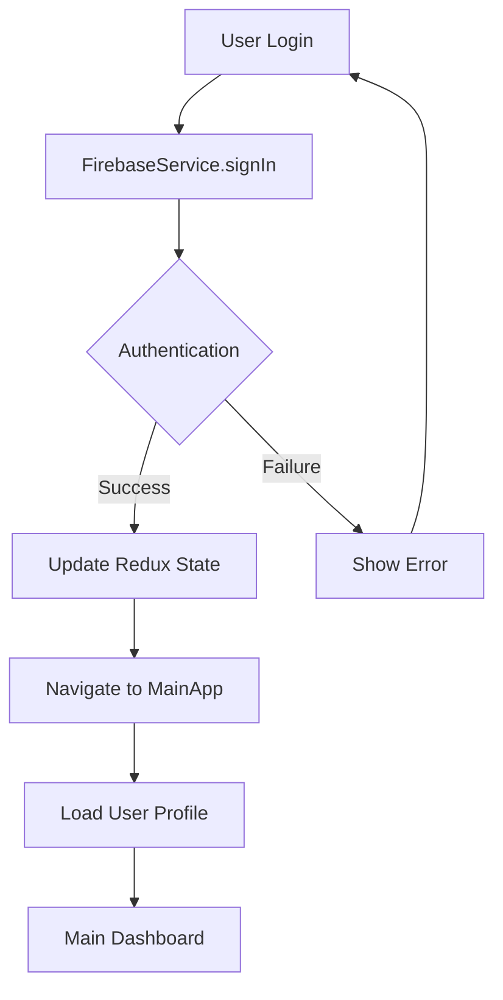
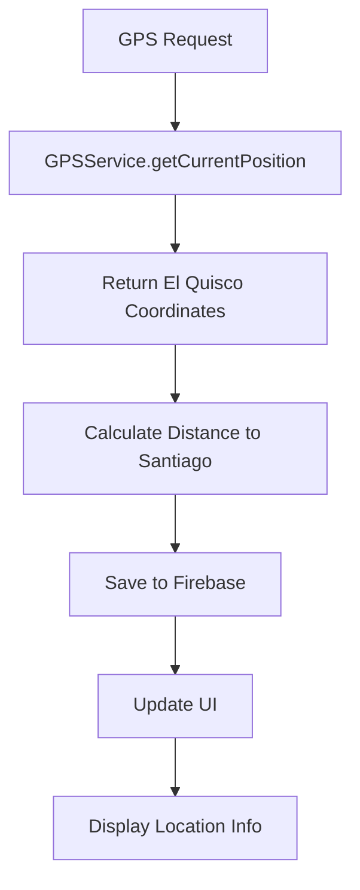
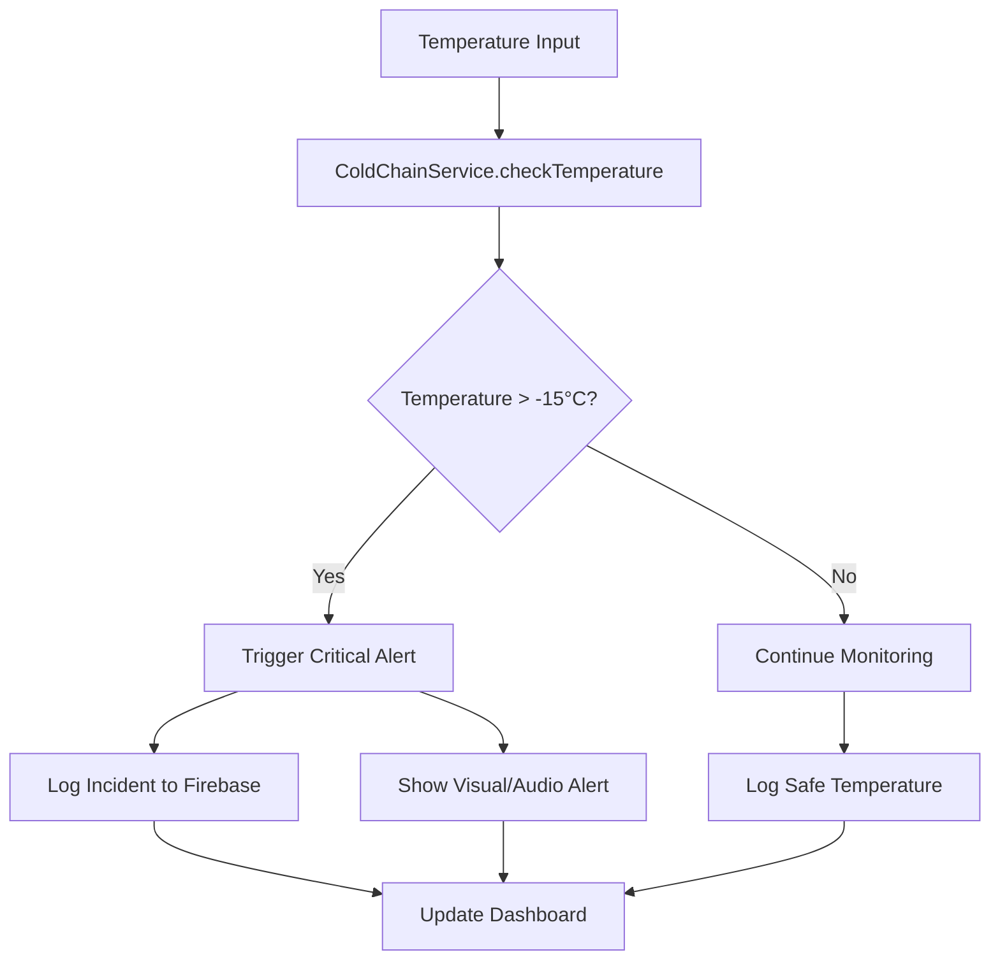

# 🏗️ Arquitectura Técnica - Taller de Logística App

## 📋 Visión General de la Arquitectura

### Patrón de Arquitectura: **MVC + Services**
```
┌─────────────────┐    ┌─────────────────┐    ┌─────────────────┐
│      View       │    │   Controller    │    │      Model      │
│   (Screens)     │◄──►│  (Navigation)   │◄──►│   (Services)    │
│                 │    │                 │    │                 │
├─────────────────┤    ├─────────────────┤    ├─────────────────┤
│ • LoginScreen   │    │ • AuthNavigator │    │ • FirebaseService│
│ • MenuActivity  │    │ • TabNavigator  │    │ • GPSService    │
│ • GPSScreen     │    │ • StackNavigator│    │ • ColdChain     │
│ • ProfileScreen │    │                 │    │ • DeliveryCalc  │
└─────────────────┘    └─────────────────┘    └─────────────────┘
```

---

## 🔄 Flujo de Datos

### 1. Autenticación Flow


### 2. GPS Tracking Flow


### 3. Cold Chain Monitoring Flow


---

## 📱 Arquitectura de Componentes

### Core Components Structure
```
src/
├── 🎯 screens/                 # Pantallas principales
│   ├── AuthNavigator.tsx         # Router principal con auth
│   ├── LoginScreen.tsx           # Autenticación de usuarios
│   ├── MenuActivity.tsx          # Dashboard central
│   ├── DeliveryCalculatorScreen.tsx # Cálculos + Cadena frío
│   ├── GPSDistanceScreen.tsx     # GPS con Haversine
│   └── ProfileScreen.tsx         # Perfil de usuario
│
├── 🔧 services/               # Lógica de negocio
│   ├── FirebaseService.ts        # Backend completo
│   ├── GPSService.ts             # Ubicación específica
│   ├── GeolocationService.ts     # Cálculos matemáticos
│   ├── ColdChainService.ts       # Monitoreo temperatura
│   └── DeliveryService.ts        # Lógica de entregas
│
├── 🧩 components/             # Componentes reutilizables
│   ├── LoadingSpinner.tsx        # Loading states
│   ├── AlertModal.tsx            # Alertas personalizadas
│   └── FormInput.tsx             # Inputs de formularios
│
├── 🗂️ types/                  # TypeScript definitions
│   ├── index.ts                  # Tipos globales
│   ├── firebase.ts              # Tipos Firebase
│   ├── gps.ts                   # Tipos GPS/Location
│   └── coldchain.ts             # Tipos cadena de frío
│
└── 🛠️ utils/                  # Utilities y helpers
    ├── constants.ts              # Constantes globales
    ├── validators.ts             # Validaciones
    └── formatters.ts             # Formateo de datos
```

---

## 🔥 Firebase Integration Architecture

### Service Layer
```typescript
class FirebaseService {
  // 🔐 Authentication Management
  static async signIn(email: string, password: string): Promise<FirebaseUser>
  static async signUp(email: string, password: string): Promise<FirebaseUser>
  static async signOut(): Promise<void>
  
  // 📊 Database Operations
  static async saveUserProfile(userId: string, profile: UserProfile): Promise<void>
  static async getUserProfile(userId: string): Promise<UserProfile | null>
  static async saveLocationToDatabase(location: LocationData): Promise<void>
  static async saveColdChainIncident(incident: ColdChainIncident): Promise<void>
  
  // 🔄 Real-time Subscriptions
  static subscribeToUserProfile(userId: string, callback: (profile: UserProfile) => void)
  static subscribeToLocationUpdates(userId: string, callback: (locations: LocationData[]) => void)
}
```

### Database Schema Design
```typescript
interface DatabaseSchema {
  users: {
    [userId: string]: {
      email: string;
      displayName: string;
      createdAt: string;
      lastLogin?: string;
      preferences?: UserPreferences;
    }
  };
  
  locations: {
    [userId: string]: {
      [locationId: string]: {
        latitude: number;
        longitude: number;
        timestamp: number;
        accuracy: number;
        address?: string;
        distanceToWarehouse?: number;
      }
    }
  };
  
  coldChainIncidents: {
    [userId: string]: {
      [incidentId: string]: {
        temperature: number;
        timestamp: number;
        severity: 'LOW' | 'MEDIUM' | 'HIGH' | 'CRITICAL';
        location: GPSCoordinate;
        productType: string;
        resolved: boolean;
        notes?: string;
      }
    }
  };
}
```

---

## 📍 GPS Service Architecture

### Coordinate System
```typescript
// Sistema de coordenadas fijo para El Quisco
const EL_QUISCO_COORDINATES = {
  latitude: -33.40863,   // Latitud Sur
  longitude: -71.696854, // Longitud Oeste
  name: 'El Quisco',
  region: 'Región de Valparaíso',
  country: 'Chile'
};

// Almacén central en Santiago
const SANTIAGO_WAREHOUSE = {
  latitude: -33.4489,    // Santiago Centro
  longitude: -70.6693,   // Santiago Centro
  name: 'Almacén Central Santiago'
};
```

### Haversine Implementation
```typescript
class GeolocationService {
  /**
   * Implementación matemática de la fórmula Haversine
   * Para cálculo preciso de distancias entre coordenadas GPS
   */
  static calculateHaversineDistance(
    coord1: GPSCoordinate, 
    coord2: GPSCoordinate
  ): DistanceResult {
    const R = 6371; // Radio de la Tierra en kilómetros
    
    // Conversión a radianes
    const lat1Rad = this.degreesToRadians(coord1.latitude);
    const lat2Rad = this.degreesToRadians(coord2.latitude);
    const deltaLatRad = this.degreesToRadians(coord2.latitude - coord1.latitude);
    const deltaLongRad = this.degreesToRadians(coord2.longitude - coord1.longitude);

    // Fórmula Haversine
    const a = Math.sin(deltaLatRad / 2) * Math.sin(deltaLatRad / 2) +
              Math.cos(lat1Rad) * Math.cos(lat2Rad) *
              Math.sin(deltaLongRad / 2) * Math.sin(deltaLongRad / 2);

    const c = 2 * Math.atan2(Math.sqrt(a), Math.sqrt(1 - a));
    const distance = R * c;

    return {
      distanceKm: parseFloat(distance.toFixed(2)),
      distanceMeters: Math.round(distance * 1000),
      origin: coord1,
      destination: coord2,
      calculationTime: Date.now()
    };
  }
}
```

---

## ❄️ Cold Chain Monitoring Architecture

### Temperature Monitoring System
```typescript
class ColdChainService {
  // 🌡️ Configuración de temperatura crítica
  private static readonly TEMPERATURE_THRESHOLDS = {
    SAFE_MIN: -25,      // Temperatura mínima segura
    SAFE_MAX: -18,      // Temperatura máxima segura  
    CRITICAL: -15,      // Umbral crítico (alerta)
    DANGER: -10         // Peligro extremo
  };

  // ⏱️ Monitoreo automático cada 30 segundos
  static startAutomaticMonitoring(productType: string): void {
    setInterval(async () => {
      const currentTemp = await this.getCurrentTemperature();
      
      if (currentTemp > this.TEMPERATURE_THRESHOLDS.CRITICAL) {
        await this.handleCriticalTemperature(currentTemp, productType);
      }
    }, 30000); // 30 segundos
  }

  // 🚨 Manejo de temperatura crítica
  private static async handleCriticalTemperature(
    temperature: number, 
    productType: string
  ): Promise<void> {
    // 1. Crear incidente
    const incident: ColdChainIncident = {
      temperature,
      timestamp: Date.now(),
      severity: this.calculateSeverity(temperature),
      productType,
      location: await GPSService.getCurrentPosition(),
      resolved: false
    };

    // 2. Guardar en Firebase
    await FirebaseService.saveColdChainIncident(incident);

    // 3. Mostrar alerta visual
    Alert.alert('🚨 ALERTA DE CADENA DE FRÍO', 
      `Temperatura crítica: ${temperature}°C`);

    // 4. Log para debugging
    console.error(`Cold Chain Alert: ${temperature}°C at ${new Date()}`);
  }
}
```

### Alert System Architecture
```typescript
interface AlertSystem {
  // 📢 Tipos de alertas
  alertTypes: {
    VISUAL: 'modal' | 'toast' | 'banner';
    AUDIO: 'beep' | 'alarm' | 'voice';
    PERSISTENCE: 'firebase' | 'local' | 'both';
  };

  // 🔔 Severidad de alertas
  severityLevels: {
    LOW: { color: '#FFC107', sound: 'beep', priority: 1 };
    MEDIUM: { color: '#FF9800', sound: 'beep', priority: 2 };
    HIGH: { color: '#F44336', sound: 'alarm', priority: 3 };
    CRITICAL: { color: '#D32F2F', sound: 'alarm', priority: 4 };
  };
}
```

---

## 🔐 Security Architecture

### Firebase Security Rules (Implementadas)
```javascript
// rules/database.rules.json
{
  "rules": {
    // 🚫 Default: Denegar todo acceso
    ".read": false,
    ".write": false,
    
    // ✅ Usuarios: Solo acceso a sus propios datos
    "users": {
      "$userId": {
        ".read": "$userId === auth.uid",
        ".write": "$userId === auth.uid"
      }
    },
    
    // ✅ Ubicaciones: Solo el usuario propietario
    "locations": {
      "$userId": {
        ".read": "$userId === auth.uid",
        ".write": "$userId === auth.uid"
      }
    },
    
    // ✅ Incidentes: Solo el usuario propietario
    "coldChainIncidents": {
      "$userId": {
        ".read": "$userId === auth.uid",
        ".write": "$userId === auth.uid"
      }
    }
  }
}
```

### Authentication Flow Security
```typescript
// 🔒 Validación de autenticación en cada pantalla
const AuthGuard = ({ children }: { children: React.ReactNode }) => {
  const { user, loading } = useAuthState();

  if (loading) {
    return <LoadingSpinner />;
  }

  if (!user) {
    return <LoginScreen />;
  }

  return <>{children}</>;
};

// 🛡️ Validación de datos de entrada
const validateUserInput = (email: string, password: string): ValidationResult => {
  const errors: string[] = [];

  if (!email || !email.includes('@')) {
    errors.push('Email inválido');
  }

  if (!password || password.length < 6) {
    errors.push('Contraseña debe tener al menos 6 caracteres');
  }

  return {
    isValid: errors.length === 0,
    errors
  };
};
```

---

## ⚡ Performance Optimizations

### Memory Management
```typescript
// 🔄 Cleanup de listeners en useEffect
useEffect(() => {
  const unsubscribeAuth = auth().onAuthStateChanged(handleAuthChange);
  const unsubscribeLocation = subscribeToLocationUpdates(handleLocationUpdate);

  // 🧹 Cleanup cuando el componente se desmonta
  return () => {
    unsubscribeAuth();
    unsubscribeLocation();
  };
}, []);

// 📱 Optimización de re-renders con React.memo
const GPSLocationDisplay = React.memo(({ location }: { location: GPSCoordinate }) => {
  return (
    <View>
      <Text>{location.name}</Text>
      <Text>Lat: {location.latitude}</Text>
      <Text>Lng: {location.longitude}</Text>
    </View>
  );
});
```

### Bundle Size Optimization
```typescript
// 📦 Lazy loading de pantallas grandes
const DeliveryCalculatorScreen = React.lazy(() => 
  import('../screens/DeliveryCalculatorScreen')
);

// 🖼️ Optimización de imágenes
const optimizedImages = {
  splash: require('../assets/images/splash-optimized.png'),
  logo: require('../assets/images/logo-compressed.jpg')
};

// 📊 Code splitting por funcionalidad
const ColdChainModule = {
  service: () => import('../services/ColdChainService'),
  components: () => import('../components/ColdChainComponents')
};
```

---

## 🧪 Testing Architecture

### Unit Testing Structure
```typescript
// tests/services/FirebaseService.test.ts
describe('FirebaseService', () => {
  test('should authenticate user with valid credentials', async () => {
    const result = await FirebaseService.signIn('test@test.com', '123456');
    expect(result.user).toBeDefined();
    expect(result.user.email).toBe('test@test.com');
  });

  test('should calculate distance correctly', () => {
    const elQuisco = { latitude: -33.40863, longitude: -71.696854 };
    const santiago = { latitude: -33.4489, longitude: -70.6693 };
    
    const distance = GeolocationService.calculateHaversineDistance(elQuisco, santiago);
    expect(distance.distanceKm).toBeCloseTo(120, 1);
  });
});
```

### Integration Testing
```typescript
// tests/integration/ColdChain.test.ts
describe('Cold Chain Integration', () => {
  test('should trigger alert when temperature exceeds threshold', async () => {
    // Arrange
    const criticalTemperature = -14; // Above -15°C threshold
    
    // Act
    const result = await ColdChainService.checkTemperature(criticalTemperature);
    
    // Assert
    expect(result.alertTriggered).toBe(true);
    expect(result.severity).toBe('CRITICAL');
  });
});
```

---

## 📊 Monitoring and Analytics

### Performance Metrics
```typescript
interface PerformanceMetrics {
  // ⏱️ Tiempos de respuesta
  responseTime: {
    firebaseAuth: number;    // ms para autenticación
    gpsLocation: number;     // ms para obtener ubicación
    databaseWrite: number;   // ms para escribir a Firebase
  };
  
  // 📱 Uso de recursos
  memoryUsage: {
    heapUsed: number;        // MB de heap usado
    heapTotal: number;       // MB de heap total
    external: number;        // MB de memoria externa
  };
  
  // 🔄 Frecuencia de uso
  featureUsage: {
    gpsRequests: number;     // Solicitudes GPS por sesión
    coldChainAlerts: number; // Alertas de cadena de frío
    calculatorUsage: number; // Uso de calculadora
  };
}
```

### Error Tracking
```typescript
// utils/ErrorTracker.ts
class ErrorTracker {
  static logError(error: Error, context: string): void {
    // 📝 Log local
    console.error(`[${context}] ${error.message}`, error.stack);
    
    // 🔥 Firebase Crashlytics (si está configurado)
    if (crashlytics) {
      crashlytics().recordError(error);
    }
    
    // 📊 Analytics personalizado
    analytics().logEvent('app_error', {
      error_message: error.message,
      error_context: context,
      timestamp: Date.now()
    });
  }
}
```

---

**📚 Documento técnico actualizado:** Septiembre 2024  
**🏗️ Arquitectura diseñada para:** Escalabilidad, Mantenibilidad y Performance